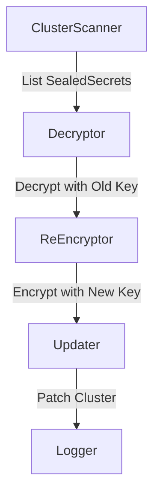

# Automated Re-Encryption of SealedSecrets  
*A Secure and Scalable Implementation Plan for `kubeseal reencrypt`*

---

## 📖 Table of Contents  
- [Introduction](#introduction)  
- [Implementation Overview](#implementation-overview)  
- [Component Breakdown](#component-breakdown)  
  - [1. ClusterScanner](#1-clusterscanner)  
  - [2. KeyManager](#2-keymanager)  
  - [3. Decryptor](#3-decryptor)  
  - [4. ReEncryptor](#4-reencryptor)  
  - [5. Updater](#5-updater)  
  - [6. Logger (Bonus)](#6-logger-bonus)  
- [Security & Scalability](#security--scalability)  
- [CLI Integration](#cli-integration)  
- [Testing & Validation](#testing--validation)  
- [Usage Examples](#usage-examples)  
- [Challenges & Mitigations](#challenges--mitigations)  
- [References](#references)  

---

<a id="introduction"></a>  
## 🧭 Introduction  
Bitnami’s SealedSecrets enables secure GitOps by encrypting Kubernetes secrets with asymmetric keys. However, **key rotation** leaves older secrets vulnerable until manually re-encrypted. This proposal automates re-encryption via a new `kubeseal reencrypt` command, ensuring all secrets use the latest key without manual intervention.

---

<a id="implementation-overview"></a>  
## 🔧 Implementation Overview  
### High-Level Workflow  
1. **Discover**: Fetch all `SealedSecrets` in the cluster/namespace.  
2. **Decrypt**: Unseal secrets using historical private keys.  
3. **Re-encrypt**: Seal secrets with the latest public key.  
4. **Update**: Apply the re-encrypted `SealedSecrets` back to the cluster.  



---

<a id="component-breakdown"></a>  
## 🔍 Component Breakdown  

<a id="1-clusterscanner"></a>  
### 1. ClusterScanner  
**Purpose**: Fetch all `SealedSecrets` from the Kubernetes API.  
**Reused Code**: Leverages the controller’s `client.List` method ([ref](https://github.com/bitnami-labs/sealed-secrets/blob/main/pkg/client/client.go)).  

```go  
// Input: Kubernetes client and target namespace (empty for cluster-wide).  
// Output: Slice of SealedSecrets or error.  
func ListSealedSecrets(client client.Client, namespace string) ([]v1beta1.SealedSecret, error) {  
    opts := []client.ListOption{client.InNamespace(namespace)}  
    var sealedSecrets v1beta1.SealedSecretList  
    err := client.List(context.Background(), &sealedSecrets, opts...)  
    return sealedSecrets.Items, err  
}  
```  

---

<a id="2-keymanager"></a>  
### 2. KeyManager  
**Purpose**: Load private/public keys from the cluster.  
**Security**: Keys are fetched from the `sealed-secrets-key` Secret and zeroized after use.  

```go  
// Input: Kubernetes Secret containing keys.  
// Output: Map of private keys + latest public key.  
func LoadKeys(keySecret *v1.Secret) (map[string]*rsa.PrivateKey, *rsa.PublicKey, error) {  
    privateKeys := parsePrivateKeys(keySecret.Data["tls.key"])  
    latestPubKey := parsePublicKey(keySecret.Data["tls.crt"])  
    return privateKeys, latestPubKey, nil  
}  
```  

**Key Rotation Handling**:  
- Uses `sealed-secrets-controller`’s key-labeling system ([ref](https://github.com/bitnami-labs/sealed-secrets/blob/main/pkg/apis/sealed-secrets/v1alpha1/sealedsecret.go#L29)).  

---

<a id="3-decryptor"></a>  
### 3. Decryptor  
**Purpose**: Decrypt secrets using historical private keys.  
**Reused Code**: Calls `UnsealSecret` from `crypto.go` ([ref](https://github.com/bitnami-labs/sealed-secrets/blob/main/pkg/crypto/crypto.go#L123)).  

```go  
// Input: SealedSecret + private key.  
// Output: Decrypted Kubernetes Secret or error.  
func DecryptSealedSecret(ss v1beta1.SealedSecret, privateKey *rsa.PrivateKey) (*v1.Secret, error) {  
    return crypto.UnsealSecret(ss.Spec.EncryptedData, privateKey)  
}  
```  

---

<a id="4-reencryptor"></a>  
### 4. ReEncryptor  
**Purpose**: Re-encrypt secrets with the latest public key.  
**Reused Code**: Uses `Seal` from `client.go` ([ref](https://github.com/bitnami-labs/sealed-secrets/blob/main/cmd/kubeseal/client.go#L150)).  

```go  
// Input: Decrypted Secret + latest public key.  
// Output: New SealedSecret or error.  
func ReEncryptSecret(secret *v1.Secret, pubKey *rsa.PublicKey) (*v1beta1.SealedSecret, error) {  
    return kubeseal.Seal(secret, pubKey, v1beta1.SchemeGroupVersion)  
}  
```  

---

<a id="5-updater"></a>  
### 5. Updater  
**Purpose**: Apply re-encrypted secrets back to the cluster.  

```go  
// Input: Kubernetes client + updated SealedSecret.  
// Output: Error if update fails.  
func UpdateSealedSecret(client client.Client, updated *v1beta1.SealedSecret) error {  
    return client.Update(context.Background(), updated)  
}  
```  

---

<a id="6-logger-bonus"></a>  
### 6. Logger (Bonus)  
**Purpose**: Track progress and failures.  

```go  
// Log Format (JSON):  
{  
  "success": bool,  
  "name": "secret-name",  
  "namespace": "default",  
  "error": "..."  
}  
```  

---

<a id="security--scalability"></a>  
## 🛡 Security & ⚡ Scalability  

### Security Measures  
- **Private Key Handling**:  
  - Keys are loaded only during re-encryption and zeroized using `memset_s` ([CWE-14](https://cwe.mitre.org/data/definitions/14.html)).  
- **RBAC**: Minimal permissions required:  
  ```yaml  
  - apiGroups: ["bitnami.com"]  
    resources: ["sealedsecrets"]  
    verbs: ["get", "list", "update"]  
  ```  

### Scalability  
- **Concurrency**: Process secrets in parallel (10 goroutines by default).  
- **Batching**: Use `ListOptions.Limit` for large clusters.  

---

<a id="cli-integration"></a>  
## 🖥 CLI Integration  
New `reencrypt` command:  

Add a new command to `kubeseal`:

```diff
 func main() {
     ...
+    reencrypt := app.Command("reencrypt", "Re-encrypt all SealedSecrets with the latest public key")
+    reencryptNamespace := reencrypt.Flag("namespace", "Target namespace").Default("").String()

     switch kingpin.MustParse(app.Parse(os.Args[1:])) {
+    case reencrypt.FullCommand():
+        return runReencrypt(*reencryptNamespace)
     }
 }
```

**Flags**:  
- `--namespace`: Target namespace (default: all).  
- `--resume-from`: Resume from a specific secret (handles interruptions).  

---

<a id="testing--validation"></a>  
## 🧪 Testing & Validation  
| Test Case                  | Method                          |  
|----------------------------|---------------------------------|  
| Key Rotation               | Mock controller with old/new keys |  
| Partial Failures           | Inject API errors               |  
| Large Cluster              | 1k+ secrets in `kind` cluster  |  

---

<a id="usage-examples"></a>  
## 📦 Usage Examples  
**Dry Run**:  
```bash  
kubeseal reencrypt --namespace=dev --dry-run  
```  
**Output**:  
```  
Re-encrypted 50/50 secrets (dry run).  
```  

---

<a id="challenges--mitigations"></a>  
## ⚠ Challenges & Mitigations  
| Challenge                | Mitigation                              |  
|--------------------------|-----------------------------------------|  
| Key Exposure             | Memory-only handling + RBAC             |  
| Legacy Secrets           | Skip and log warnings                  |  
| API Throttling           | Exponential backoff retries            |  

---

<a id="references"></a>  
## 📚 References  
- [SealedSecrets Crypto Logic](https://github.com/bitnami-labs/sealed-secrets/blob/main/pkg/crypto/crypto.go)  
- [Kubeseal CLI](https://github.com/bitnami-labs/sealed-secrets/blob/main/cmd/kubeseal/client.go)  
