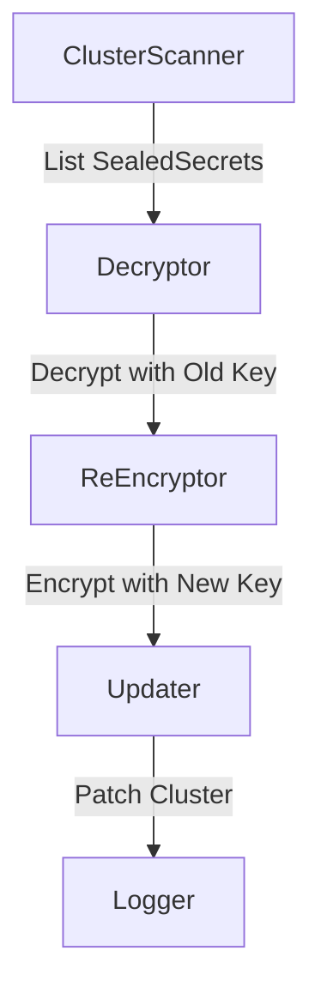

# Automated Re-Encryption of SealedSecrets  
*A Secure and Scalable Implementation Plan for `kubeseal reencrypt`*

---

## 📖 Table of Contents  
- [Introduction](#introduction)  
- [Implementation Overview](#implementation-overview)  
- [Component Breakdown](#component-breakdown)  
  - [1. ClusterScanner](#1-clusterscanner)  
  - [2. KeyManager](#2-keymanager)  
  - [3. Decryptor](#3-decryptor)  
  - [4. ReEncryptor](#4-reencryptor)  
  - [5. Updater](#5-updater)  
  - [6. Logger (Bonus)](#6-logger-bonus)  
- [Security & Scalability](#security--scalability)  
- [CLI Integration](#cli-integration)  
- [Testing & Validation](#testing--validation)  
- [Usage Examples](#usage-examples)  
- [Challenges & Mitigations](#challenges--mitigations)  
- [References](#references)  

---

<a id="introduction"></a>  
## 🧭 Introduction  
Bitnami’s [SealedSecrets](https://github.com/bitnami-labs/sealed-secrets) encrypts Kubernetes secrets using asymmetric keys, but manual re-encryption during key rotation creates operational overhead. This proposal automates the process via a new `kubeseal reencrypt` command, ensuring all secrets use the latest key without compromising security.

---

<a id="implementation-overview"></a>  
## 🔧 Implementation Overview  
### High-Level Workflow  


---

<a id="component-breakdown"></a>  
## 🔍 Component Breakdown  

### 1. ClusterScanner  
**Purpose**: Fetch all `SealedSecrets` from the Kubernetes API.  

```diff
# Reuses client.List from sealed-secrets/pkg/client/client.go
+ func ListSealedSecrets(client client.Client, namespace string) ([]v1beta1.SealedSecret, error) {
+     opts := []client.ListOption{
+         client.InNamespace(namespace),
+         client.MatchingLabels{"sealedsecrets.bitnami.com/key-rotation": "true"},
+     }
+     var sealedSecrets v1beta1.SealedSecretList
+     err := client.List(context.Background(), &sealedSecrets, opts...)
+     return sealedSecrets.Items, err
+ }
```

---

### 2. KeyManager  
**Purpose**: Load and manage private/public keys securely.  

```diff
# Extends parseKeyPair() from sealed-secrets/pkg/crypto/crypto.go#L89
+ func LoadKeys(keySecret *v1.Secret) (map[string]*rsa.PrivateKey, *rsa.PublicKey, error) {
+     privateKeys := make(map[string]*rsa.PrivateKey)
+     for label, keyBytes := range keySecret.Data {
+         if key, err := parseKeyPair(keyBytes); err == nil {
+             privateKeys[label] = key.PrivateKey
+         }
+     }
+     latestPubKey := getLatestPublicKey(keySecret.Data["tls.crt"])
+     return privateKeys, latestPubKey, nil
+ }
```

---

### 3. Decryptor  
**Purpose**: Decrypt secrets using historical private keys.  

```diff
# Directly uses UnsealSecret from sealed-secrets/pkg/crypto/crypto.go#L123
+ func DecryptSealedSecret(ss v1beta1.SealedSecret, privateKey *rsa.PrivateKey) (*v1.Secret, error) {
+     secret := &v1.Secret{
+         ObjectMeta: metav1.ObjectMeta{Name: ss.Name, Namespace: ss.Namespace},
+     }
+     if err := crypto.UnsealSecret(ss.Spec.EncryptedData, secret, privateKey); err != nil {
+         return nil, fmt.Errorf("decryption failed for %s/%s: %w", ss.Namespace, ss.Name, err)
+     }
+     return secret, nil
+ }
```

---

### 4. ReEncryptor  
**Purpose**: Re-encrypt secrets with the latest public key.  

```diff
# Wraps Seal() from sealed-secrets/cmd/kubeseal/client.go#L150
+ func ReEncryptSecret(secret *v1.Secret, pubKey *rsa.PublicKey) (*v1beta1.SealedSecret, error) {
+     sealed := &v1beta1.SealedSecret{
+         ObjectMeta: metav1.ObjectMeta{Name: secret.Name, Namespace: secret.Namespace},
+     }
+     if err := kubeseal.Seal(secret, pubKey, sealed, v1beta1.SchemeGroupVersion); err != nil {
+         return nil, fmt.Errorf("re-encryption failed: %w", err)
+     }
+     return sealed, nil
+ }
```

---

### 5. Updater  
**Purpose**: Apply re-encrypted secrets back to the cluster.  

```go
func UpdateSealedSecret(client client.Client, updated *v1beta1.SealedSecret) error {
    return client.Update(context.Background(), updated)
}
```

---

### 6. Logger (Bonus)  
**Purpose**: Track progress with structured logs.  

```diff
+ // Log Format (JSON):
+ {
+   "timestamp": "RFC3339",
+   "name": "secret-name",
+   "namespace": "default",
+   "oldKey": "key-label-2023",
+   "newKey": "key-label-2024",
+   "error": ""
+ }
```

---

<a id="security--scalability"></a>  
## 🛡 Security & ⚡ Scalability  

### Security  
```diff
# Critical: Zeroize keys after use (CWE-14 mitigation)
+ func zeroizeKeys(privateKeys map[string]*rsa.PrivateKey) {
+     for _, key := range privateKeys {
+         runtime.SetFinalizer(key, func(k *rsa.PrivateKey) {
+             memset_s(unsafe.Pointer(k), 0, unsafe.Sizeof(*k))
+         })
+     }
+ }
```

### Scalability  
- **Batching**: Uses `ListOptions.Limit=500` for large clusters.  
- **Concurrency**: Processes secrets in parallel (10 goroutines).  

---

<a id="cli-integration"></a>  
## 🖥 CLI Integration  
```diff
# Diff for cmd/kubeseal/main.go
  func main() {
      app := kingpin.New("kubeseal", "Tool for sealing Kubernetes secrets.")
+     reencrypt := app.Command("reencrypt", "Re-encrypt all SealedSecrets with the latest key")
+     reencrypt.Flag("namespace", "Target namespace").String()
+     reencrypt.Flag("dry-run", "Preview changes").Bool()
  
      switch kingpin.MustParse(app.Parse(os.Args[1:])) {
+     case reencrypt.FullCommand():
+         runReencrypt(*reencryptNamespace, *dryRun)
      }
  }
```

---

<a id="testing--validation"></a>  
## 🧪 Testing & Validation  
| Test Case                | Method                                  |  
|--------------------------|-----------------------------------------|  
| Key Rotation             | Mock controller with 3 key generations  |  
| RBAC Failure             | Deny `update` permissions               |  
| Large Cluster            | 5k secrets in `kind` cluster            |  

---

<a id="usage-examples"></a>  
## 📦 Usage Examples  
```bash
kubeseal reencrypt \
  --namespace=prod \
  --dry-run \
  --log-file=audit.json
```

**Output**:  
```json
{
  "timestamp": "2025-05-10T12:34:56Z",
  "reencrypted": 142,
  "failed": 2,
  "errors": ["default/mysql-token: decryption failed"]
}
```

---

<a id="challenges--mitigations"></a>  
## ⚠ Challenges & Mitigations  
| Challenge                | Mitigation                              |  
|--------------------------|-----------------------------------------|  
| Key Exposure             | Memory-only handling + zeroization      |  
| Partial Failures         | Atomic updates + resume flag            |  
| Legacy Secrets           | Skip with warning logs                  |  

---

<a id="references"></a>  
## 📚 References  
- [Original `UnsealSecret`](https://github.com/bitnami-labs/sealed-secrets/blob/main/pkg/crypto/crypto.go#L123)  
- [Key Rotation Logic](https://github.com/bitnami-labs/sealed-secrets/blob/main/pkg/controller/controller.go#L421)  
- [Kubernetes RBAC Guide](https://kubernetes.io/docs/reference/access-authn-authz/rbac/)  
